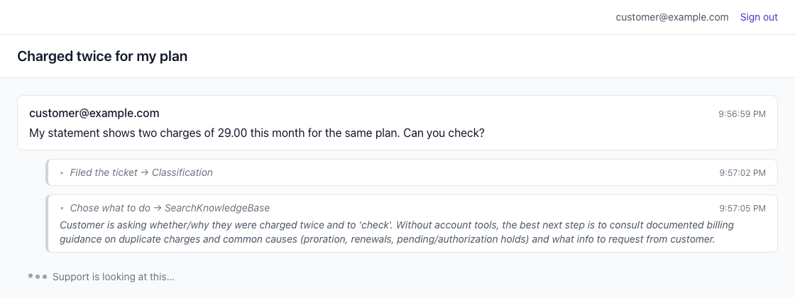
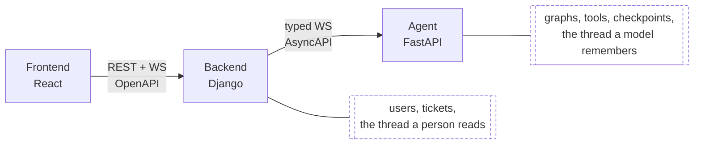

import SeriesMap from "@/components/SeriesMap.astro";

> **TL;DR** The stack is Python, Pydantic AI for agents, LangGraph for the flow, [chanx](https://github.com/huynguyengl99/chanx) for typed streaming WebSockets and a generated frontend contract, OpenTelemetry into a trace store you own, pytest with a mocked LLM for fast tests, and real-model evals for regressions. Business logic stays in a separate service from the agent graph. The single idea holding it together: every boundary in the system is a declared, typed artifact rather than something you hold in your head. This post makes the case for each piece so you can bring it to your team, then lays out what we build in the rest of the series.

[Part 0](/posts/agent-graph-engineering/before-it-had-a-name/) was the story: years of shipping LLM features as intent detection plus nested conditionals, and why observability tooling never fixed the underlying problem. This post is the pragmatic half.

> One clarification first, because the word is overloaded. This series is about the _execution_ graph of an agent: state, nodes, edges, routing, interrupts, resumption. It is not graph RAG, and not knowledge graphs. Those are retrieval techniques, where a graph is the data you query. Graph RAG could sit behind one node here as one tool among several. Same word, different concept, and that collision is a large part of why there is so little material on this subject.

## The one idea

Everything below follows from a single principle: **the structure of your AI system should be a declared artifact, not something reconstructed by reading code.**

Your flow should be a graph you can render. Your tool inputs and outputs should be schemas. Your WebSocket messages should be a contract your frontend can generate a client from. Your agent's output should have a type.

The reason is not elegance. It is that declared structure can be rendered, validated, traced, and diffed automatically, while structure that only exists as control flow can only be understood by a human reading it. That difference is what decides whether your system survives its third feature and its second engineer.

## Why this is worth your time

The case for each piece is below. Before that, the reasons you might care beyond whatever you are shipping this week, because I think there are three different readers here.

If your team already runs an agent in production, you do not need convincing that it is hard. The useful part is the set of practices that remove whole categories of bug rather than fixing them one at a time. Typed tool arguments turn a wrong type into a validation error at the edge instead of a `TypeError` three frames into your own code. Structured output means you route on `isinstance` rather than on whether the response happened to contain the word "escalate". Generated contracts mean a message shape cannot drift between two codebases without the compiler noticing. Checkpointing means a crashed run resumes instead of vanishing. Guardrails at both edges mean the text you screened is the text that ships. Evals mean a model upgrade is a measurement rather than a gamble. None of those are features you gain. They are bugs you stop having, which is a different and better thing.

If you are about to build your first one, the useful part is the order. These decisions are sequenced the way they actually bite, and the one that is cheap this month and expensive next year is the service split, which is why it turns up early rather than in a footnote. Reading ahead costs an afternoon and might save you a rewrite.

If you are building for yourself or for a client, the repository is the point. It is distilled from a production system of five services, out of roughly five years on realtime infrastructure and agent systems, so the parts that look over-careful are mostly the parts that broke somewhere else first. It is production-shaped rather than notebook-shaped, and it runs on one API key, or none at all. Moving it to another domain is mostly swapping tools, prompts, and edges. I want to be careful with the word production, though. The shape is right and the last mile is real, so the final post is a plain list of what you still owe before paying users touch it. Nobody is helped by pretending a checkout is a deployment.

Then there is the market, if you are weighing where to put your learning time. Stanford's AI Index 2026 found that mentions of the "agentic AI" skill cluster in job postings grew more than 280% in a year, from 0.06% of postings in 2024 to 0.23% in 2025, which is roughly 90,000 US listings. Fast growth from a small base, and both halves of that matter: it is early, and it is moving. The detail I find more telling sits in the same report. Mentions of "ChatGPT", "conversational AI" and "chatbots" went down over the same period. Demand moved off demos. Korn Ferry's 2026 survey of 1,674 talent leaders has 52% planning to deploy autonomous agents by the end of this year, which is the same shift seen from the other side of the table.

The job ads are the more useful signal, though, and they say something slightly different from the headline. Reading through current senior backend openings, the ones that touch AI are not asking for prompt engineering. They ask for distributed systems, availability and latency targets, production Python, schema and API design, architecture review across teams, and operational practice: service levels, incident response, containers and orchestration. AI turns up as a capability expected _inside_ all that, rather than instead of it. That is a more demanding ask than the hype implies, and it maps almost exactly onto what this series builds, which is a system with contracts, traces, tests and a deployment story that happens to have a model in it.

The sentence that keeps turning up in hiring write-ups is that a demo agent is easy and a reliable one is not, and that eval literacy is the clearest sign somebody has actually shipped. That is more or less this entire series, arrived at independently and the slow way.

## The stack

| Layer          | Choice                 | What it buys you                                                                                   |
| -------------- | ---------------------- | -------------------------------------------------------------------------------------------------- |
| Language       | Python                 | The only ecosystem where every provider, every serving runtime, and every eval tool shows up first |
| Agent          | Pydantic AI            | Typed tools, typed outputs, typed deps, provider independence                                      |
| Flow           | LangGraph              | Declared graph, renderable diagram, inspectable state, checkpointing                               |
| Transport      | chanx                  | Typed WebSocket messages, broadcast from anywhere, generated AsyncAPI contract                     |
| Tracing        | OpenTelemetry          | One connected trace per user message, readable with no account and exportable to any OTLP backend  |
| Tests          | pytest + mocked LLM    | Fast, deterministic, no API spend                                                                  |
| Regressions    | Evals with real models | Catch what mocks cannot when you change a model or a prompt                                        |
| Business logic | A separate service     | Keeps your product's domain out of your agent's graph                                              |

### Python

Not a controversial pick, but worth stating the actual reason. It is not that Python has the best SDK for calling an API, because every language has that now. It is everything around the call: local model serving, embeddings, evaluation harnesses, vector stores, document parsing. When you eventually need to run a model yourself or plug in a tool nobody has wrapped yet, Python is where it already exists.

### Pydantic AI, for the agent

An agent is a thing with a declared output type and a declared set of tools. Pydantic AI is built on exactly that, and being Pydantic-native means your tool schemas and output schemas are the same objects you already validate with.

What that gets you in practice:

- **Structured output.** The agent returns a typed object, not a string you regex. Routing on `isinstance` beats routing on substring matching.
- **Validated tool calls.** The model's arguments are checked before your code runs. A wrong type is a caught validation error, not a `TypeError` three frames deep.
- **Provider independence.** Switching providers is a config change. This matters more than it sounds like it does, because you will want a cheap model for routing decisions and a strong one for synthesis.
- **Typed dependencies.** Your tools receive a typed context object instead of reading globals.

A word on determinism, because it gets oversold. You cannot make the model deterministic, and anyone promising that is selling something. What you can do is make everything around it deterministic: the model's only job is to return a value of a declared type, and every other step on the path is ordinary code you can test. That shift is most of what separates a system from a prompt.

You could use a provider's own SDK or an ADK instead. I would not, because the moment you want a second provider or a self-hosted model, the abstraction you skipped has to be written anyway, and it will be worse.

If you want to see this layer on its own before the graph arrives, I wrote it up separately in [Streaming Agents with Pydantic AI over Typed WebSockets](/posts/pydantic-ai-typed-websockets-fastapi/). That post is a good prerequisite for this series.

### LangGraph, for the flow

This is the piece that changes how you work, and the piece your team will push back on. So be specific about the trade.

**The cost is real.** You stop writing handler functions and start declaring state, nodes, and conditional edges. A branch becomes an edge. A handler becomes a subgraph. It takes a few weeks to stop fighting it, and the first graph you write will be wrong.

**What you get back:**

- **A diagram from the code.** LangGraph exports Mermaid. Your architecture picture is generated from the thing that actually runs, so it cannot go stale. No more hand-drawn draw.io files that lie.
- **Inspectable state at every step.** You can see what the state was going into a node and coming out. When something breaks, you know which transition did it rather than guessing.
- **Checkpointing.** Graph state persists. A run can be paused, resumed, and recovered after a crash, which is also the mechanism that makes human-in-the-loop approvals work rather than being a bolt-on.
- **Structure that survives change.** Adding a capability means adding a node and an edge, not threading another condition through an existing chain.

The honest downsides: it is a LangChain-ecosystem library, so some of the ergonomics assume LangChain; and streaming from non-LangChain code goes through a generic custom channel, which is the gap chanx fills.

### chanx, for transport and contract

Disclosure: I wrote [chanx](https://github.com/huynguyengl99/chanx), because I kept rebuilding the same thing. The [intro post](/posts/chanx-structured-websockets-django-fastapi/) has the full background.

Three things it does for an agent system:

- **Broadcast from anywhere.** A node buried in a subgraph can emit a progress event to the right user without the graph passing a stream handle down through every call. You can stream the model's reasoning while it works, instead of going silent and then dumping everything.
- **Typed messages instead of a `receive_json` if/else chain.** Every message is a model, routing is automatic, and bad payloads fail at the edge.
- **Generated AsyncAPI docs.** This is the one nobody else does. Your WebSocket contract becomes a spec, and your frontend generates a TypeScript client from it. Change the graph, regenerate, and the compiler tells the frontend what broke. Your REST API has had this via OpenAPI for a decade; there is no reason your agent layer should not.

It works with Django, FastAPI, or Litestar, which matters because we use two of them.

### OpenTelemetry, into a trace store you own

The usual advice here is to name a vendor. I would rather name the standard, because the vendor is the part you should be able to change.

Both LangGraph and Pydantic AI instrument themselves with OpenTelemetry, so once a graph node opens a span, every model call inside it is already a child. You get one connected trace covering graph transitions and model calls together, rather than the flat list of completions a dashboard usually shows you.

What this stack does with those spans is the part I would argue for. They go into a small trace store inside the agent service, which means `/traces` renders a run as the chain of steps it was with **no account, no signup, and no configuration**. That matters more than it sounds. A reference implementation that needs a vendor account before it shows you anything has lost most of its readers at step one, and an on-call engineer at 2am should not need a third party to answer "what did this run do".

Exporting onward is then one environment variable: off, files on disk, an OTLP collector, or both. Any OTLP-speaking backend should work, since that is the point of a standard, and the repo covers that path with a fake collector that checks spans really leave the process with the right endpoint and auth header. Honest limit: that proves the export path, not any particular vendor's ingestion. Langfuse, Jaeger and Grafana are all OTLP endpoints plus a header, but I have verified the path rather than each product.

When a user reports that the agent did something strange in production, you want evidence, not a reproduction attempt. This is the piece that gives you evidence, and it is yours.

### pytest with a mocked LLM

Mock at the HTTP layer, not at the framework layer. If you stub Pydantic AI's client you test your stubs. If you intercept the HTTP call and return a recorded provider response, the real pipeline runs: SSE parsing, tool call assembly, streaming, validation. Your tests then cover the parts that actually break.

These tests are fast, deterministic, and free, so you can run them on every commit and cover full WebSocket flows end to end.

### Evals with real models

Mocked tests prove your code works. They cannot tell you whether the model still picks the right tool after you reworded a prompt, or whether the new model release routes the same way.

That is what evals are for: scenarios run against real providers, on demand and never in CI, because they cost money. Pydantic AI has an eval module, or a plain script works. Without this you cannot upgrade a model without fear, which in practice means you stop upgrading.

### Keep business logic out of the agent

Put your product's domain (users, permissions, billing, persistence) in one service and your agent graph in another. I have shipped the merged version and it becomes a mess: business rules leak into prompts, graph concerns leak into models, and neither side can be tested alone.

Separated, the agent service has one job, and the boundary between them is a contract you can generate a client from.

## What we build

A support ticket triage assistant. A ticket arrives, and the agent decides what to do with it: answer it directly, search the knowledge base, escalate it to a human, or draft a reply. Posting that reply to the customer requires human approval; searching the knowledge base does not.

Two views of one ticket. The customer sees it being worked, step by step:

The team sees the same ticket with their own lane on it, internal notes beside the agent's answers and the step it chose:

I picked this deliberately. It needs real routing, so the graph earns its place instead of being a two-node demo. It has a naturally irreversible action, so the approval machinery is solving an actual problem rather than an invented one. And it runs on an LLM key alone, with no OAuth flows or third-party signups standing between you and a working checkout.

The shape:

Three services, one repository. The frontend generates its clients from OpenAPI and AsyncAPI. The backend owns users, tickets, and history. The agent service owns the graphs, the tools, and the checkpoints, and talks to nobody's database but its own.

It is small enough to read in an afternoon and complete enough to adopt: generated contracts on both boundaries, real WebSocket worker processes, approval interrupts on irreversible tools, guardrails on the input and output edges, streamed progress, a span per graph node with per-run cost, three test suites that spend nothing, evals against real providers, and container images serving ASGI. The architecture is production-grade and the deployment is production-shaped. What it does not do yet, context budgeting and spend caps among others, is written down in the repo rather than glossed over, and the last post walks that gap. Every post is pinned to a tag so you can check out the exact state being described.

## The series map

Each post stands alone, so you can start wherever your current problem is rather than reading in order. Where a post turns out to be carrying two posts' worth of material I would rather split it than pad it, so a number may grow a letter. Greyed-out entries are written but not published yet.

<SeriesMap series="Agent Graph Engineering" current="the-stack-and-why-each-piece-is-there" />

Post 6 is the one I expect to be most useful. State that survives a pause, and a run that resumes into the middle of itself, are the hardest parts in practice and the least written about anywhere. The ordering inside it is not negotiable either: persistence has to come before interrupts, because an interrupt only works at all because the checkpointer exists.

## What it costs

I do not want to undersell the ramp. Declaring flows as graphs is a genuine shift in how you think, and the first few weeks are slower than writing the conditionals would have been. Expect to throw away your first graph design once you understand state properly.

What you get on the other side is an AI system you can point at, trace, test, and change. The agent stops being magic and starts being software.

Next up is the service split, then types and contracts, and then the posts get into code. Hope this one is useful in the meantime, particularly if you are the person who has to justify the stack to everyone else.

I write these deep-dives and maintain a handful of Python libraries, so if that is your kind of thing, follow along on [GitHub](https://github.com/huynguyengl99) and [LinkedIn](https://www.linkedin.com/in/huynguyengl99/).
