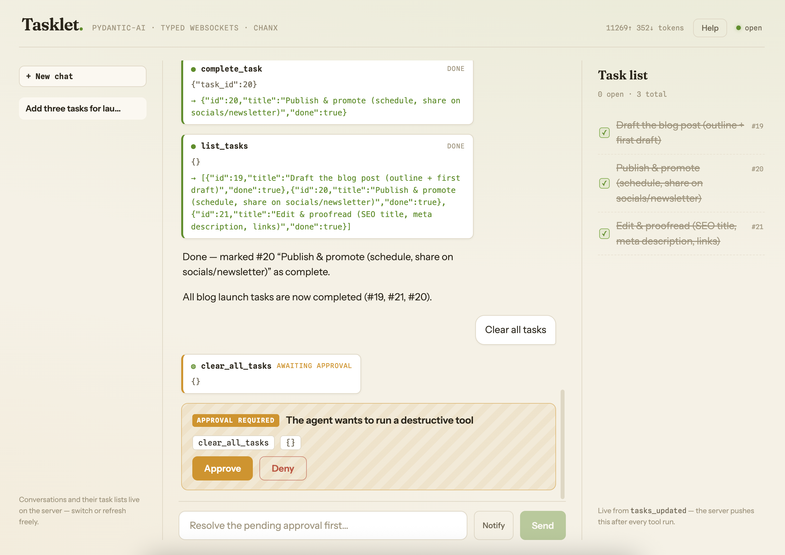
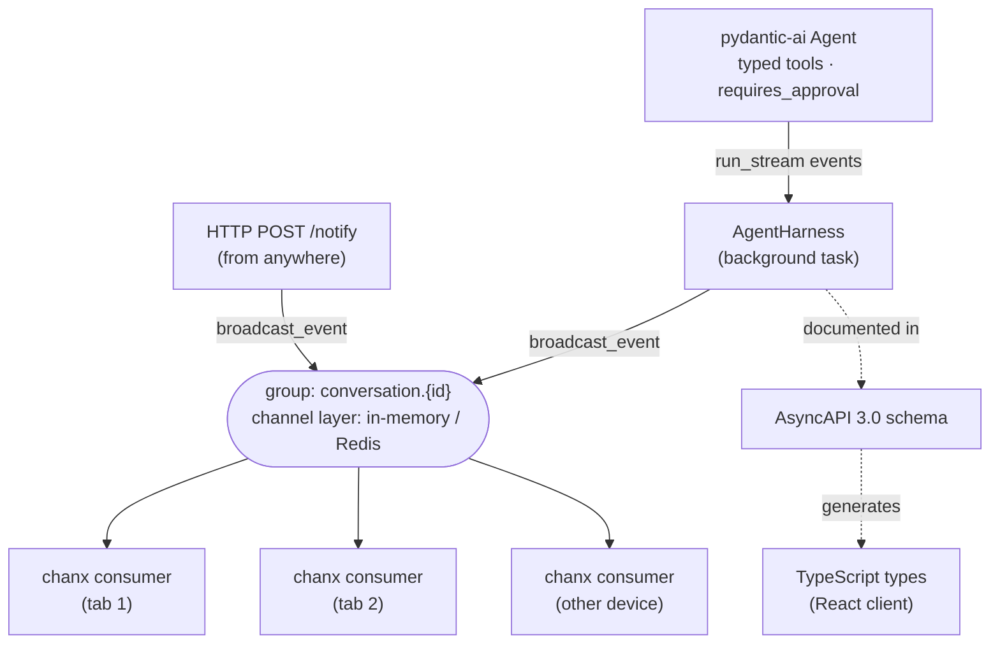

I've been building realtime products for years: group chat, voice pipelines, streaming AI assistants. Two kinds of pain kept following me around.

The first was WebSockets. Every project grew the same untyped `receive_json` handler with an if/else chain, hand-written validation, and no contract the frontend could rely on. Messages were stringly-typed, bugs surfaced at runtime, and onboarding a teammate meant "read the consumer, end to end". That pain is why I built [chanx](https://github.com/huynguyengl99/chanx): typed messages, automatic routing, AsyncAPI docs (the full story is in [my intro post](/posts/chanx-structured-websockets-django-fastapi/)).

The second was agent frameworks. I shipped my first LLM features on LangChain and spent more time debugging its abstractions than my own code. [Pydantic AI](https://pydantic.dev/docs/ai/) won me over the first time I tried it: typed tools, typed outputs, typed dependency injection. It applies to agents the same philosophy chanx applies to WebSockets, and since both are built on Pydantic they snap together with almost no glue.

There's just one gap. At the UI layer, pydantic-ai's official story is SSE-shaped: adapters for [AG-UI and the Vercel AI protocol](https://pydantic.dev/docs/ai/integrations/ui/overview/), and a built-in [`Agent.to_web()`](https://pydantic.dev/docs/ai/guides/web/) chat page that the docs explicitly label as a dev tool. Real agent products want more than a one-way stream. A conversation is *bidirectional*: the user sends prompts, the agent streams back text and tool activity, and (the interesting part) the agent sometimes has to **stop and ask permission** before running a destructive tool. That round trip (pause, ask, resume) fits a WebSocket perfectly, and there is currently no WebSocket example anywhere in the pydantic-ai docs.

So I built one, the same way I build REST APIs: **contract-first**. The server defines every message as a Pydantic model, chanx turns those models into routed handlers plus an AsyncAPI 3.0 schema, and the React client generates its TypeScript types *from* that schema. Backend and frontend can't drift, teammates integrate from the contract instead of reading your Python, and the whole thing (streaming, tool calls, approvals) is testable without ever calling an LLM.

Companion repo with everything runnable: [huynguyengl99/pydantic-ai-ws-agent](https://github.com/huynguyengl99/pydantic-ai-ws-agent). Snippets below are trimmed for reading and current as of pydantic-ai 2.9 and chanx 2.8; the repo is the source of truth.

## Table of contents

## The big picture

The demo agent ("Tasklet") manages a task list in SQLite. Safe tools run freely; destructive ones pause for approval.





Four pieces: a plain pydantic-ai **agent** (typed tools, typed deps, `requires_approval` on the dangerous ones, structured output); a **harness** that runs it and translates each event into a typed message; a **channel layer** that carries those events to a per-conversation group rather than a single socket; and a chanx **consumer** that validates, routes, and documents the protocol the React client generates its types from.

## The agent: tools that know they're dangerous

Nothing here is WebSocket-aware. It's a standard pydantic-ai agent with two deliberate choices: a structured output type, and typed deps carrying the conversation id so every tool operates on that conversation's tasks.

```python
class TextAnswer(BaseModel):
    """Final answer to the user, with suggested follow-up prompts."""

    content: str
    follow_ups: list[str] = Field(default_factory=list)


@dataclass
class AgentDeps:
    conversation_id: str


# Every run ends as either a final answer or a request for tool approval.
AgentOutput = TextAnswer | DeferredToolRequests


def build_agent(model: Model | str | None = None) -> Agent[AgentDeps, AgentOutput]:
    agent: Agent[AgentDeps, AgentOutput] = Agent(
        model or settings.resolved_model,
        deps_type=AgentDeps,
        output_type=[TextAnswer, DeferredToolRequests],
        instructions=INSTRUCTIONS,
    )

    @agent.tool
    async def add_task(ctx: RunContext[AgentDeps], title: str) -> db.TaskItem:
        """Add a new task with the given title."""
        return await db.add_task(ctx.deps.conversation_id, title)

    @agent.tool(requires_approval=True)
    async def delete_task(ctx: RunContext[AgentDeps], task_id: int) -> str:
        """Permanently delete the task with the given id. Requires user approval."""
        await db.delete_task(ctx.deps.conversation_id, task_id)
        return f"Task {task_id} deleted"

    return agent
```

(The repo has six tools; `clear_all_tasks` is the other one behind approval.)

`requires_approval=True` is pydantic-ai's [deferred tools](https://pydantic.dev/docs/ai/tools-toolsets/deferred-tools/) feature. When the model calls `delete_task`, the tool does **not** execute. Instead the run ends early and `result.output` is a `DeferredToolRequests` carrying the pending calls, which is exactly why `output_type` is a union: every run ends as either a final answer or a request for permission, and the type system makes you handle both.

`TextAnswer` instead of plain `str` is the structured-output half of the story. Alongside the answer text, the model fills `follow_ups` with three suggested next prompts that the UI renders as clickable chips. The final answer isn't prose with conventions bolted on; it's a validated object, and the chips ride along in the same schema.

`build_agent()` being a factory instead of a module-level singleton matters later: tests build the same agent with a fake model.

## The message contract

Every WebSocket message is a Pydantic model with a `Literal` action field. chanx uses that field as a discriminator for validation, routing, and docs:

```python
class ChatMessage(BaseMessage):
    """User sends a prompt to the agent."""
    action: Literal["chat"] = "chat"
    payload: ChatPayload
```

The full protocol is small. Client → server: `chat`, `tool_decision`. Server → client: `user_message`, `stream_start`, `text_delta`, `tool_call`, `tool_result`, `approval_request`, `stream_end`, `suggestions`, `history`, `tasks_updated`, `notification`, `agent_error`.

The consumer binds it together: handlers declare what they accept and what they may reply with, and that declaration *is* the documentation:

```python
@channel(name="agent", description="Pydantic AI task assistant over a typed WebSocket")
class AgentConsumer(BaseConsumer):
    passthrough_events: ClassVar[list[type[BaseMessage]]] = BROADCAST_MESSAGES

    @ws_handler(
        summary="Send a prompt to the agent",
        output_type=AgentServerMessage,  # the union of everything we may send back
    )
    async def handle_chat(self, message: ChatMessage) -> None:
        self._spawn_run(self.harness.run(message.payload.text))

    @ws_handler(summary="Approve or deny pending tool calls", output_type=AgentServerMessage)
    async def handle_tool_decision(self, message: ToolDecisionMessage) -> None:
        self._spawn_run(self.harness.resolve(message.payload.decisions))
```

No if/else routing, no manual validation, and `/asyncapi.json` now serves an AsyncAPI 3.0 spec describing every message above: the WebSocket equivalent of what drf-spectacular gives you for REST (I wrote about that workflow in [the schema-first post](/posts/schema-first-api-development-drf-react/)).

## Streaming structured output: snapshots into deltas

Streaming plain text is easy. Streaming a *structured* answer is the interesting part: the final output is a `TextAnswer` object, so there is no raw text stream to forward. pydantic-ai's answer is `run_stream()` plus two hooks.

Tool events arrive through an `event_stream_handler`, which the harness maps straight onto the message contract:

```python
async def forward_tool_events(
    _ctx: RunContext[AgentDeps], events: AsyncIterable[AgentStreamEvent]
) -> None:
    async for event in events:
        match event:
            case FunctionToolCallEvent(part=part):
                await self.send(ToolCallMessage(payload=ToolCallPayload(
                    tool_call_id=part.tool_call_id,
                    tool_name=part.tool_name,
                    args=part.args_as_dict(),
                )))
            case FunctionToolResultEvent(part=part):
                await self.send(ToolResultMessage(payload=ToolResultPayload(
                    tool_call_id=part.tool_call_id,
                    content=to_jsonable_python(part.content),
                )))
```

The answer itself streams as *partially validated snapshots*: `stream_output()` yields a growing `TextAnswer` each time more of the model's JSON arrives. Diffing successive `content` values recovers the text deltas to send:

```python
sent_text = ""
async with self.agent.run_stream(
    user_prompt,
    message_history=history,
    deferred_tool_results=deferred_tool_results,
    deps=AgentDeps(conversation_id=self.conversation_id),
    event_stream_handler=forward_tool_events,
) as stream:
    async for partial in stream.stream_output(debounce_by=None):
        match partial:
            case TextAnswer(content=content) if content and content != sent_text:
                delta = (
                    content.removeprefix(sent_text)
                    if content.startswith(sent_text)
                    else content
                )
                await self.send(TextDeltaMessage(payload=TextDeltaPayload(delta=delta)))
                sent_text = content
        output = partial
    await db.save_history(self.conversation_id, stream.all_messages_json().decode())
```

The client sees `text_delta` for prose and `tool_call`/`tool_result` pairs for tool activity (rendered as live cards in the UI), and the loop stays completely ignorant of *which* tools exist.

After the loop, the union output type earns its keep:

```python
match output:
    case DeferredToolRequests() as requests:
        # run_stream stops forwarding events once the final result (the paused
        # calls) is found, so announce them here: same ids, same wire order.
        for part in requests.approvals:
            await self.send(ToolCallMessage(payload=ToolCallPayload(...)))
        PENDING_APPROVALS[self.conversation_id] = requests
        await self.send(approval_request_message(requests))
    case TextAnswer(content=content, follow_ups=follow_ups):
        await self.send(StreamEndMessage(payload=StreamEndPayload(text=content, usage=...)))
        if follow_ups:
            await db.save_suggestions(self.conversation_id, follow_ups)
            await self.send(SuggestionsMessage(payload=SuggestionsPayload(follow_ups=follow_ups)))
```

One subtlety worth calling out: a deferred tool call never reaches the `event_stream_handler` (deferred means "not executed", and only executing tools emit events), so the harness announces the paused calls itself before the `approval_request`. The client renders the same tool cards either way; it can't tell which path produced them. And on the happy path, the suggestions arrive as their own message *after* `stream_end`, so the chips pop in once the answer settles.

## Broadcast, don't send: background runs and groups

My first version awaited the agent run *inside* the chat handler and wrote messages straight to the socket. It worked, but with three quiet problems: the handler blocks for the whole run, a page refresh mid-run kills the stream, and a second tab sees nothing.

The fix is the pattern chanx (and Django Channels before it) is built around: **broadcast to a group, not to a connection**. Every consumer joins a per-conversation group on connect, and the run executes as a background task that broadcasts events to that group:

```python
async def post_authentication(self) -> None:
    group = f"conversation.{self.conversation_id}"
    await self.channel_layer.group_add(group, self.channel_name)
    self.harness = AgentHarness(agent, self.conversation_id, self._broadcast)

async def _broadcast(self, message: BaseMessage) -> None:
    await self.broadcast_event(message, groups=f"conversation.{self.conversation_id}")

def _spawn_run(self, coro) -> None:
    # The task outlives this connection: a client that refreshes mid-run
    # keeps receiving events through the conversation group.
    RUNNING[self.conversation_id] = asyncio.create_task(guarded(coro))
```

On the receiving side there is nothing to write. chanx's `passthrough_events` generates the event handlers: any message type in the list that arrives via the group is forwarded to the WebSocket client verbatim, and documented in AsyncAPI like everything else.

What this buys, concretely (all covered by tests):

- **The chat handler returns immediately**; a per-conversation `RUNNING` dict rejects concurrent runs with a typed `agent_error`
- **Refresh-proof streams**: the run keeps going without any socket attached; reconnect replays history and picks up live events
- **Multi-tab for free**: every tab renders the same deltas, tool cards, and approval requests. Even the user's own prompt travels this way, echoed as a `user_message` before `stream_start`, so the sending tab renders the bubble from the same broadcast as everyone else instead of appending locally
- **Approve from anywhere**: pending approvals are keyed by conversation, not connection; request approval on one device, approve on another

### Beyond the socket: HTTP, workers, other frameworks

`broadcast_event` is a classmethod, so *anything* can push typed messages into a conversation. The demo exposes `POST /conversations/{id}/notify`, and a `curl` fires a toast on every connected tab. The agent uses the same door from the inside: a `schedule_reminder` tool reads the conversation id from `ctx.deps`, schedules a job, and returns immediately; when the job fires long after `stream_end`, it broadcasts a `notification` into the group.

That escape hatch scales in two directions. Group broadcast isn't the only delivery mode: chanx can address a single connection, so a handler can hand heavy work to a real task queue (taskiq, Celery, ARQ) using `self.channel_name` as a typed reply address:

```python
# consumer: queue the job with a reply address
await run_agent_job.kiq(prompt, reply_to=self.channel_name)

# worker process: send typed events back to that exact connection
await AgentConsumer.send_event(JobProgressEvent(payload=...), reply_to)

# consumer: typed, routed, and documented like everything else
@event_handler
async def handle_job_progress(self, event: JobProgressEvent) -> ProgressMessage:
    return ProgressMessage(payload=event.payload)
```

The consumer stays a thin protocol adapter while the LLM work happens in a process built for it. And since the channel layer is just Redis, and chanx speaks the same API on Django Channels and FastAPI, the socket and the agent don't even have to share a service. A split I run in production: Django owns the user-facing WebSocket (sessions, ORM auth, a consumer that's little more than `passthrough_events`) while a separate FastAPI service runs the models and broadcasts into the same conversation groups. Django never awaits an LLM; the agent service never touches a session. The contract is the only thing they share, and that's the part AsyncAPI documents.

The demo runs on an in-memory layer with zero dependencies; set `REDIS_URL` and the same code spans processes and instances.

## Human-in-the-loop: the approval round trip

This is the part WebSockets were made for. The full sequence:

1. Model calls `delete_task` → the run ends with `DeferredToolRequests`, and the harness announces the paused calls as `tool_call` messages, so the UI shows the tool card immediately (status: *awaiting approval*)
2. The server sends `approval_request`, persists the message history, and simply stops. No polling, no hanging request
3. The user clicks Approve or Deny → client sends `tool_decision`
4. The harness builds `DeferredToolResults` and **resumes the run** with the saved history:

```python
async def resolve(self, decisions: list[ToolDecision]) -> None:
    approvals = {
        d.tool_call_id: (
            ToolApproved(override_args=d.override_args)
            if d.approved
            else ToolDenied(message=d.reason or "Denied by the user")
        )
        for d in decisions
    }
    del PENDING_APPROVALS[self.conversation_id]
    await self.run(None, DeferredToolResults(approvals=approvals))
```

The resumed run is just another `run_stream()` call: approved tools execute (their events stream through the same handler), denied tools return the denial message to the model, and the model streams a final response either way. `ToolApproved(override_args=...)` is a lovely detail: the user can *edit* the arguments as part of approving, which is how real review UIs should work.

Approvals also survive reconnects, in both directions. Pending requests are keyed by conversation rather than connection, and the consumer re-sends the open `approval_request` to every new connection, so a refresh mid-approval gets a working approval card instead of a dead end. The E2E test literally approves from a second browser tab. One UI subtlety falls out of multi-tab: when a run resumes, other tabs still showing an open approval card mark it "resolved from another session" on the next `stream_end`.

### The gotcha: tell the model the harness has it covered

My first instructions said "destructive operations require user approval". The model took that personally. Instead of calling `delete_task`, it *asked in chat*: "This is permanent, do I have your approval? (yes/no)". Technically obedient, completely bypassing the typed approval flow.

The fix is to be explicit about the division of labor:

```
When the user asks for a destructive operation, call the tool directly — do NOT
ask for confirmation in chat. The system automatically pauses destructive tool
calls and asks the user for approval in the UI.
```

If you build approval flows, this prompt bug will find you. The model needs to know that safety is *infrastructure*, not its job.

## AsyncAPI → TypeScript: the client writes itself

chanx serves the contract at `/asyncapi.json`; every payload above appears in `components.schemas` as plain JSON Schema. A ~100-line script fetches the spec, collects the client-bound and server-bound messages from the AsyncAPI *operations* (inputs vs replies), and feeds them to `json-schema-to-typescript`:

```ts
// generated - src/generated/messages.ts
export interface ToolCallMessage {
  action: "tool_call";
  payload: ToolCallPayload;
}
export type ClientMessage = ChatMessage | ToolDecisionMessage;
export type ServerMessage = /* union of all twelve server messages */;
```

One codegen detail worth knowing: Pydantic marks `action` as optional in JSON Schema (it has a default), but it's the discriminator, so the script forces it into `required` for TypeScript to narrow on. With that, the entire client state layer is a single exhaustive switch:

```ts
function applyServer(state: ChatState, msg: ServerMessage): ChatState {
  switch (msg.action) {
    case "text_delta":       // append to the streaming bubble
    case "tool_call":        // add a tool card
    case "approval_request": // render Approve/Deny
    case "suggestions":      // show follow-up chips
    case "stream_end":       // finalize + count tokens
    // TypeScript errors if any server message is unhandled
  }
}
```

Rename a field in a Pydantic payload, run `pnpm generate`, and `tsc` lists every client line that just became wrong. Same loop as schema-first REST: the transport changed, the discipline didn't.

## Persistence: history as a typed artifact

pydantic-ai ships `ModelMessagesTypeAdapter`, a `TypeAdapter` for full message histories, so conversation state is just another validated blob: `stream.all_messages_json()` on the way out, `ModelMessagesTypeAdapter.validate_json(raw)` on the way back in. Two functions, no bespoke serialization.

On connect, the consumer replays the conversation as a `history` message plus the current task list (`tasks_updated`) and the latest follow-up chips. The transcript builder walks the typed history and reconstructs the *interleaving*: user text, assistant text, and tool cards in order, each card carrying a `done`, `denied`, or `awaiting` status, so a denied deletion still renders as denied after a refresh. Since everything is stored per conversation, a sidebar with `/conversations` (titles derived from the first prompt) and conversation delete falls out almost for free. Multi-turn context, reconnects, and resume-after-approval all sit on these same two functions.

## Testing the whole flow without an LLM

The part I care most about: the entire WebSocket protocol (streaming, tool execution, approval, denial, history replay) runs in pytest with **no API key**. pydantic-ai's `FunctionModel` plays the model; a stream function scripts exactly what "the LLM" does. One wrinkle of structured output: the final answer is itself a call to the output tool, so the script emits that too:

```python
async def delete_task_flow(messages, info):
    tool_return = next(
        (p for p in messages[-1].parts if isinstance(p, ToolReturnPart)), None
    )
    if tool_return is not None:
        # After the tool ran, answer via the structured-output tool
        yield {0: DeltaToolCall(
            name=info.output_tools[0].name,
            json_args=json.dumps({"content": f"Result: {tool_return.content}"}),
        )}
    else:
        yield {0: DeltaToolCall(name="delete_task", json_args='{"task_id": 1}')}
```

chanx's `WebsocketCommunicator` drives the consumer, and the assertions read like the protocol spec:

```python
await comm.send_message(ChatMessage(payload=ChatPayload(text="Delete task 1")))
replies = await comm.receive_all_messages(stop_action="approval_request")

# the prompt echoes to the group, the paused call is announced, the run pauses
assert [m.action for m in replies] == [
    "user_message", "stream_start", "tool_call", "approval_request",
]
assert (await db.list_tasks("conv-delete")) != []     # nothing deleted yet

await comm.send_message(ToolDecisionMessage(...approved=True...))
replies = await comm.receive_all_messages(stop_action="stream_end")
assert await db.list_tasks("conv-delete") == []       # now it's gone
```

The rest of the suite covers the deny path, **two tabs receiving identical broadcast feeds**, **approving from a fresh connection after a disconnect**, the concurrent-run guard, transcript replay with denied and awaiting tool cards, and a contract test that pulls `/asyncapi.json` and asserts every message type is present, so the schema the frontend generates from can't silently lose a message. Twenty tests, a couple of seconds, no LLM.

One trap worth sharing: `Agent.override(model=...)` uses contextvars, which don't propagate into the consumer's task under the test communicator. The factory pattern sidesteps it: tests call `build_agent(FunctionModel(...))` and patch the consumer's agent directly.

## Production notes

The demo makes three simplifications you'd revisit for production:

- **Scaling out**: the repo ships a `docker-compose.yml` for Redis, and the README walks through the two-instance demo (chat on one port, watch the same stream on another).
- **Auth**: the consumer trusts the `conversation` query param. chanx has an authentication hook (`post_authentication`) where you'd validate a session or token before joining the group and replaying history.
- **Durable pending approvals**: pending `DeferredToolRequests` live in an in-process dict; store them in the database if approvals must survive restarts. And if you ever accept message history *from* the client, run it through pydantic-ai's `sanitize_messages` first.

## Takeaways

- **WebSockets are the natural transport for agents with approvals**: pause and resume are just messages, in both directions, on one connection. pydantic-ai's `run_stream()` + `DeferredToolRequests`/`DeferredToolResults` hand you streaming and human-in-the-loop as library features; the harness adapting them to a transport is ~150 lines
- **Structured output streams too**: partial-validation snapshots diff into text deltas, and extra fields like follow-up suggestions ride along in the same schema
- **Treat the WebSocket protocol as a contract**: Pydantic models with discriminated actions on the server, AsyncAPI in the middle, generated TypeScript on the client
- **Run in the background, broadcast to a group**: refresh-proof streams, multi-tab sync, approve-from-anywhere, and server-initiated notifications all come from one decision; events go to the conversation, not the socket. The same layer lets you offload runs to a worker or put a Django socket in front of a FastAPI agent
- Tell the model that approval is handled by infrastructure, or it will improvise its own confirmation dialog in prose
- Script the model with `FunctionModel` and test the entire flow offline; deterministic agent tests are entirely achievable

I hope this saves you some of the pain it took me to learn. If you try the pattern (or have your own tricks for agent WebSockets), the repo issues are open.

## Links

- Companion repo: [huynguyengl99/pydantic-ai-ws-agent](https://github.com/huynguyengl99/pydantic-ai-ws-agent)
- [Pydantic AI docs](https://pydantic.dev/docs/ai/) · [deferred tools](https://pydantic.dev/docs/ai/tools-toolsets/deferred-tools/) · [testing](https://pydantic.dev/docs/ai/testing/)
- [chanx](https://github.com/huynguyengl99/chanx) - typed WebSockets for Django and FastAPI ([my intro post](/posts/chanx-structured-websockets-django-fastapi/))
- [Schema-first API development with DRF + React](/posts/schema-first-api-development-drf-react/) - the same philosophy for REST
