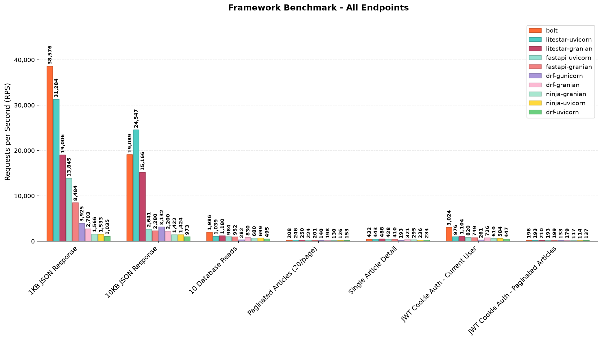
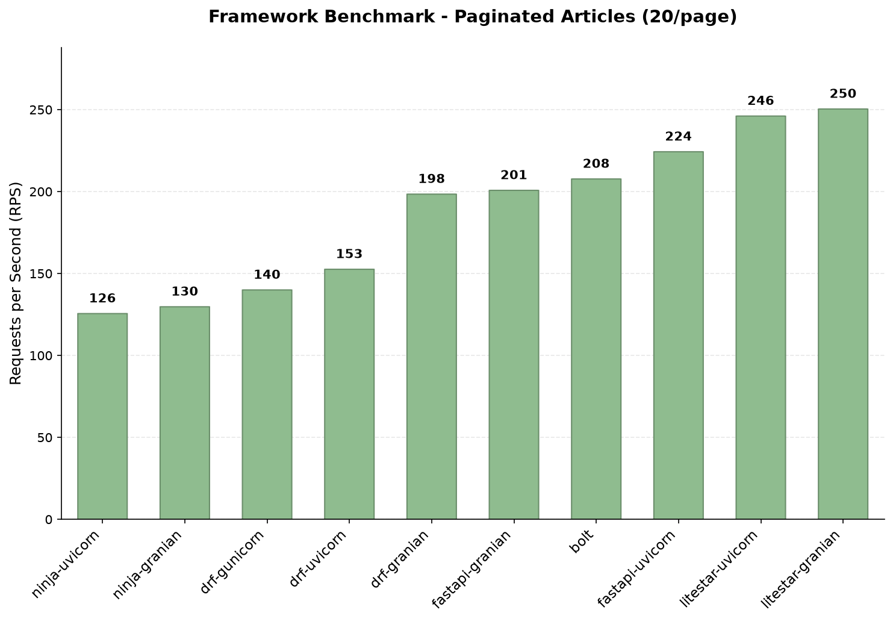
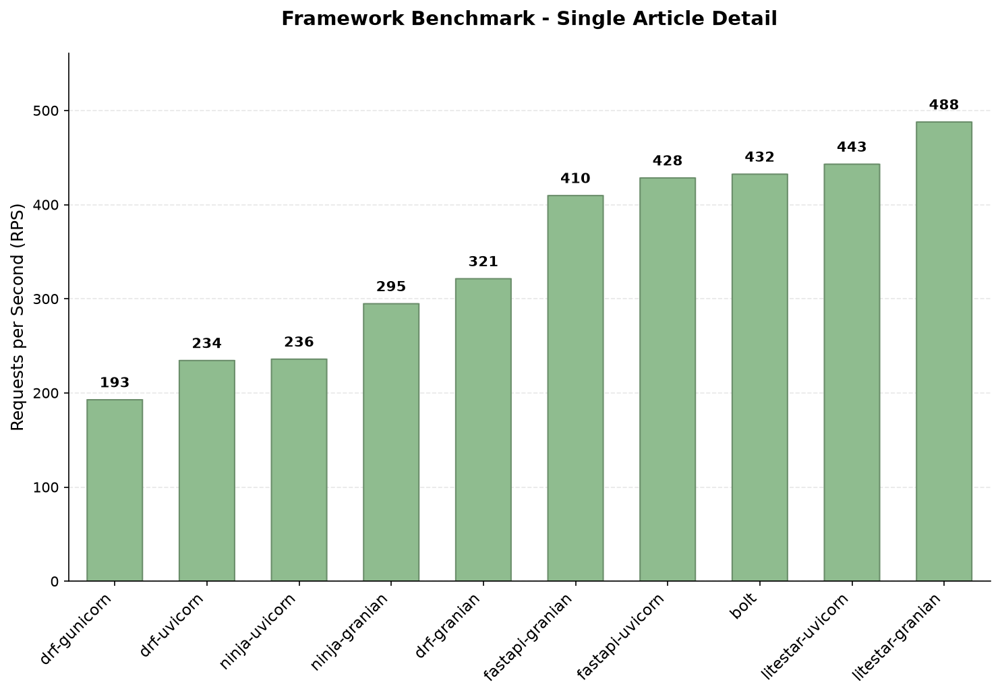
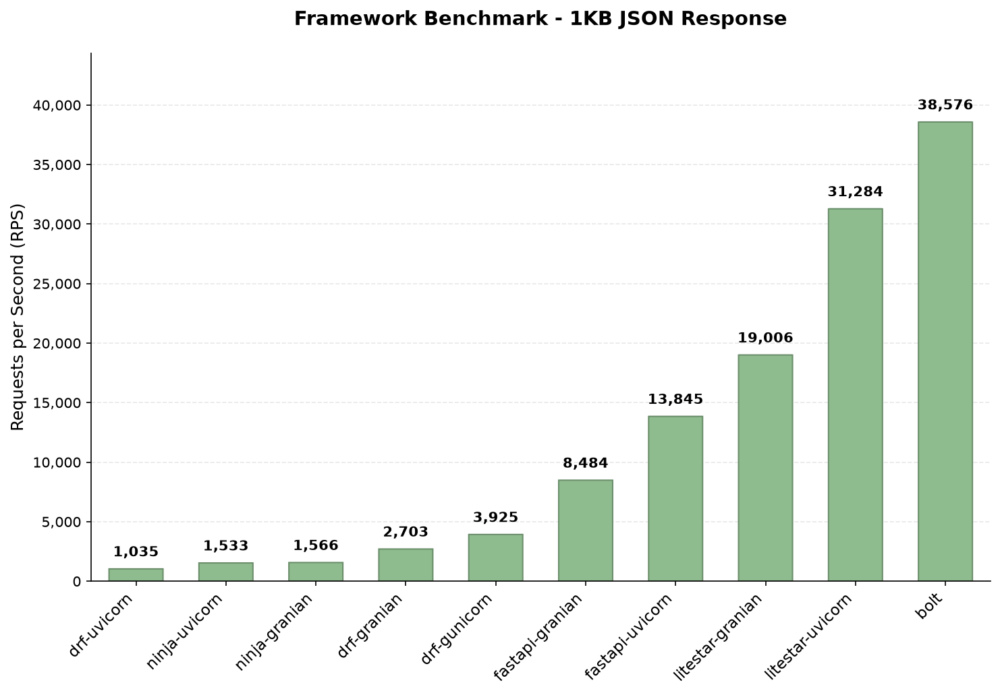
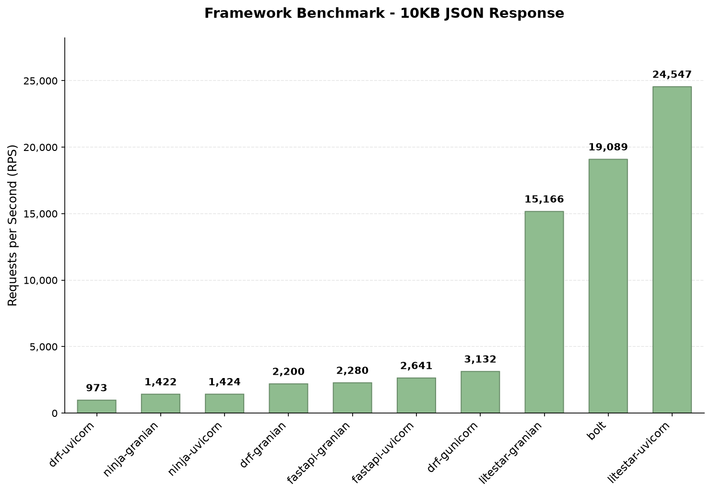
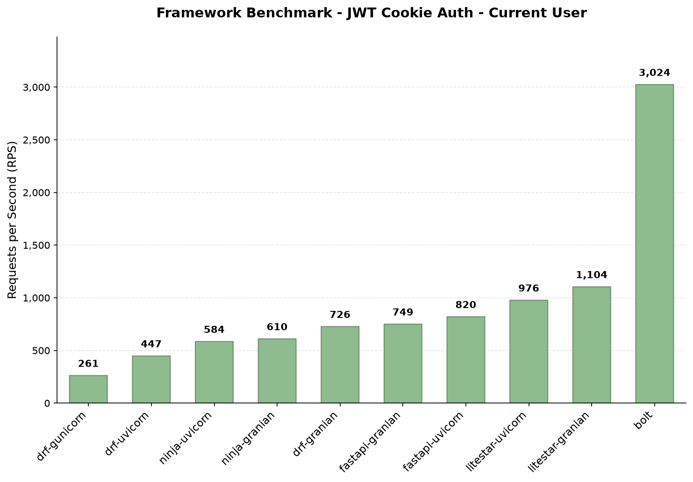
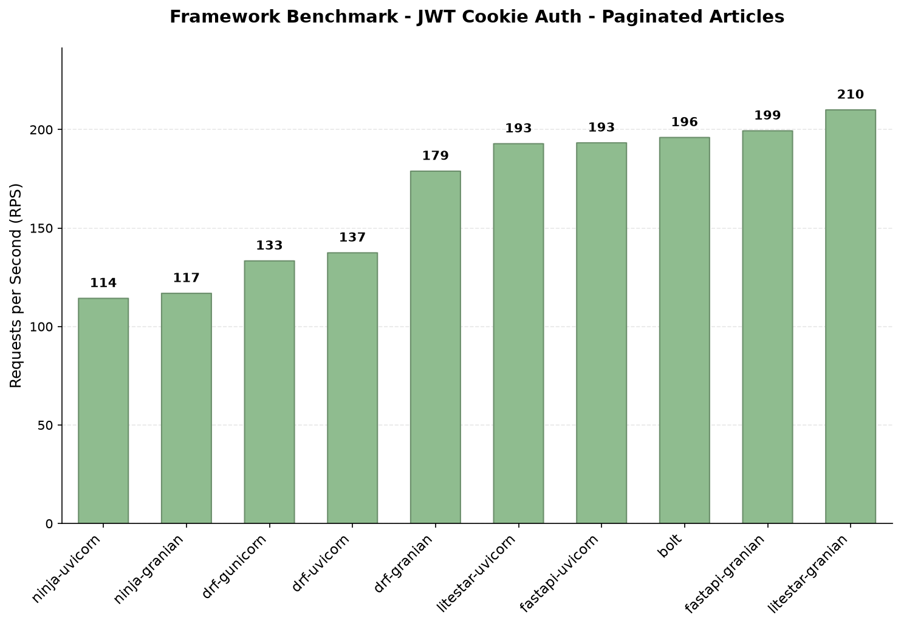
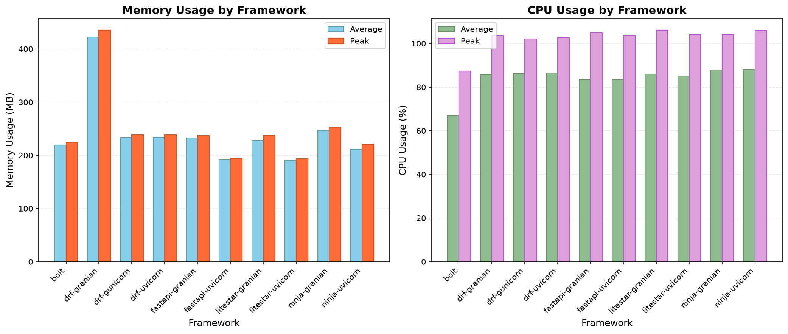

Almost every Python framework benchmark measures the same thing: how fast the framework can turn a dict into JSON. It is a real number, but it is not the number you ship against. Real endpoints hit a database, and real endpoints are usually behind authentication.

So I benchmarked **FastAPI, Litestar, Django REST Framework, Django Ninja and Django Bolt** against real PostgreSQL workloads: nested relationships, pagination, and eager loading written the way each framework recommends (`select_related`/`prefetch_related` for Django, `selectinload` for SQLAlchemy). Each framework runs on multiple production servers, one at a time, in isolated Docker containers with hard resource limits. Each one also uses its own native serializer rather than a shared one, because a shared serializer measures the serializer instead of the framework.

Two of the endpoints sit behind **a JWT in an httpOnly cookie**, each framework using its own ecosystem's auth library. That is the setup I would actually put in production, and it is the part nobody seems to benchmark.

Every implementation follows its framework's best practices. This is a comparison of properly written production code, not naive versions of it.

The short version: on plain JSON the spread between fastest and slowest is 37x. On an authenticated paginated query it is 1.8x. And if you rank by p99 latency instead of median throughput, the leaderboard is not the same leaderboard.

That chart is the whole argument in one image. The JSON endpoints are so much faster than everything else that all five database endpoints collapse into an unreadable strip at the bottom. If a benchmark only shows you the left half of that chart, it is showing you the part of your latency budget that does not matter.

Code, raw results, and a reproducible Docker setup: [python-api-frameworks-benchmark](https://github.com/huynguyengl99/python-api-frameworks-benchmark).

## Table of contents

## What was measured

**Configs** (10 total, framework + server):

| Framework | Versions | Servers | Serializer | Cookie JWT library |
| --------- | -------- | ------- | ---------- | ------------------ |
| Django Bolt | 0.10.0 | runbolt (Rust/Actix) | msgspec | built-in `JWTAuthentication(cookie=...)` |
| Litestar | 2.24.0 | uvicorn, granian | msgspec | built-in `JWTCookieAuth` |
| FastAPI | 0.141.1 | uvicorn, granian | Pydantic | AuthX |
| Django REST Framework | 3.18.0 | uvicorn, granian, gunicorn+gevent | DRF serializers | drf-auth-kit |
| Django Ninja | 1.6.2 | uvicorn, granian | Pydantic | django-ninja-jwt |

Django 6.0, Python 3.12. FastAPI and Litestar talk to PostgreSQL through SQLAlchemy 2.0 with asyncpg; the three Django-based frameworks use the ORM with a psycopg 3 connection pool.

**Setup:**

- MacBook M2 Pro, 32GB RAM; PostgreSQL 16
- Data: 500 articles, 2,000 comments, 100 tags, 50 authors
- One framework per Docker container, `--memory=750m --cpus=1`, never two at once
- bombardier, 100 connections, 10s per measurement, 1,000-request warmup
- **5 independent container starts per framework**, median reported, min-max as spread
- `select_related`/`prefetch_related` on Django, `selectinload` on SQLAlchemy

**Endpoints:**

| Endpoint | What it does |
| -------- | ------------ |
| `/json-1k` | Static list of 6 dicts, ~1KB |
| `/json-10k` | Static list of 55 dicts, ~10KB |
| `/db` | 10 simple rows |
| `/articles?page=1&page_size=20` | Paginated, nested author + tags |
| `/articles/1` | One article, nested author + tags + comments |
| `/auth/me` | Cookie JWT, verify, load user, serialize |
| `/auth/articles` | Cookie JWT, verify, load user, then the paginated query |

One design decision matters for reading the auth results: **all five frameworks load the user row from the database on both authenticated endpoints.** Litestar, DRF and Ninja do that as part of authenticating. AuthX and Bolt's guards only verify the signature, so I made FastAPI and Bolt load the user explicitly. Without that they would be doing strictly less work and the comparison would be meaningless.

## Results

Zero errors across all 70 measurements.

| Config | json-1k | json-10k | /db | /articles | /articles/1 | /auth/me | /auth/articles |
| ------ | ------: | -------: | --: | --------: | ----------: | -------: | -------------: |
| bolt | **38,576** | 19,089 | **1,986** | 208 | 432 | **3,024** | 196 |
| litestar-uvicorn | 31,284 | **24,547** | 1,039 | 246 | 443 | 976 | 193 |
| litestar-granian | 19,006 | 15,166 | 1,180 | **250** | **488** | 1,104 | **210** |
| fastapi-uvicorn | 13,845 | 2,641 | 984 | 224 | 428 | 820 | 193 |
| fastapi-granian | 8,484 | 2,280 | 952 | 201 | 410 | 749 | 199 |
| drf-gunicorn | 3,925 | 3,132 | 282 | 140 | 193 | 261 | 133 |
| drf-granian | 2,703 | 2,200 | 830 | 198 | 321 | 726 | 179 |
| ninja-granian | 1,566 | 1,422 | 680 | 130 | 295 | 610 | 117 |
| ninja-uvicorn | 1,533 | 1,424 | 699 | 126 | 236 | 584 | 114 |
| drf-uvicorn | 1,035 | 973 | 495 | 153 | 234 | 447 | 137 |

## The gap collapses as soon as work is real

Fastest divided by slowest, endpoint by endpoint:

| Endpoint | Spread | Fastest | Slowest |
| -------- | -----: | ------- | ------- |
| `/json-1k` | **37.3x** | bolt 38,576 | drf-uvicorn 1,035 |
| `/json-10k` | 25.2x | litestar-uvicorn 24,547 | drf-uvicorn 973 |
| `/db` | 7.0x | bolt 1,986 | drf-gunicorn 282 |
| `/articles/1` | 2.5x | litestar-granian 488 | drf-gunicorn 193 |
| `/articles` | 2.0x | litestar-granian 250 | ninja-uvicorn 126 |
| `/auth/articles` | **1.8x** | litestar-granian 210 | ninja-uvicorn 114 |

37x becomes 1.8x. And note the direction of travel: the more realistic the endpoint, the smaller the spread. The authenticated paginated query, which is about as close to a real API call as anything here, has the tightest spread of all seven.

This is not a new finding, but it is worth restating because it holds no matter which knob I turn: native serializer or shared one, authenticated or public, sampled per run or per container start. If your endpoint touches PostgreSQL, your framework is not your bottleneck. Your queries are.

## FastAPI's default JSON encoder is the outlier

Look at what happens between `/json-1k` and `/json-10k`. The payload goes from 6 objects to 55, roughly 9x more data:

| Config | json-1k | json-10k | Drop | Added time per request |
| ------ | ------: | -------: | ---: | ---------------------: |
| litestar-uvicorn | 31,284 | 24,547 | 1.3x | +9µs |
| ninja-uvicorn | 1,533 | 1,424 | 1.1x | +50µs |
| drf-uvicorn | 1,035 | 973 | 1.1x | +62µs |
| drf-gunicorn | 3,925 | 3,132 | 1.3x | +65µs |
| **fastapi-uvicorn** | 13,845 | 2,641 | **5.2x** | **+306µs** |

Every other config pays 9 to 65 microseconds for the extra 9KB. FastAPI pays 306. That is not a rounding difference, it is a different code path.

And it is not Pydantic validation, because none of the JSON endpoints declare a `response_model` in any framework. They all return a plain list of dicts. What is different is the encoder: Litestar's default is msgspec, while FastAPI's default `JSONResponse` runs the returned object through `jsonable_encoder` (a recursive, pure-Python walk of every dict, key and value) and then hands it to the standard library's `json.dumps`. DRF and Ninja also use `json.dumps`, but without the extra recursive walk in front of it, which is why they sit at +50 to +65µs while FastAPI sits at +306.

The practical version of this finding: **FastAPI's JSON numbers here reflect its default, not its ceiling.** Switching to `ORJSONResponse` (or setting `default_response_class`) removes most of that gap, and it is a one-line change. If you serve large JSON payloads from FastAPI and have never touched the response class, that is probably the cheapest performance win available to you.

## What authentication actually costs

`/auth/articles` runs the exact same query as `/articles`, plus: read the cookie, verify the JWT, load the user. So the difference between the two is a clean measurement of what auth costs.

| Config | public | authed | cost |
| ------ | -----: | -----: | ---: |
| fastapi-granian | 201 | 199 | 1% |
| drf-gunicorn | 140 | 133 | 5% |
| bolt | 208 | 196 | 6% |
| ninja-uvicorn | 126 | 114 | 10% |
| ninja-granian | 130 | 117 | 10% |
| drf-granian | 198 | 179 | 10% |
| drf-uvicorn | 153 | 137 | 10% |
| fastapi-uvicorn | 224 | 193 | 14% |
| litestar-granian | 250 | 210 | 16% |
| litestar-uvicorn | 246 | 193 | 22% |

1% to 22%, clustered around 10%. That is cheaper than I expected, and it is worth knowing precisely because "auth overhead" is the kind of thing people hand-wave about when they are choosing an architecture.

The more useful detail is *where* the cost is. It is not the cryptography. HMAC-verifying a short JWT is microseconds of work, and you can see that in the numbers: the configs that pay the most are not the ones with the slowest JWT library. **The cost is the user lookup**, which means one more database round trip on an endpoint that is already database-bound.

That explains the one outlier. Litestar pays the most (16-22%), and there is a concrete structural reason: `JWTCookieAuth` runs as middleware, which executes *before* dependency injection resolves. So its `retrieve_user_handler` cannot reuse the request's session and opens its own instead. Every authenticated request acquires two connections from the pool rather than one. Under 100 concurrent connections against a single CPU, pool acquisition is exactly where you do not want to double up.

The mirror image is Bolt at 6% and FastAPI on granian at 1%, where the guard verifies the signature and the user load happens inside the handler using the session that is already open.

## Moving auth into Rust only pays when Python is the bottleneck

Those two charts above are the same authentication, and they tell opposite stories.

On `/auth/me`, Bolt does 3,024 RPS against 1,104 for the next best config. That is 2.7x, and the reason is that Bolt extracts and validates the cookie JWT in Rust, before any Python runs. When the endpoint is "verify a token, load one row, serialize one small object," framework overhead is most of the request, so removing it from Python shows up enormously.

On `/auth/articles`, the identical auth in front of a paginated query with nested relations, Bolt does 196 against litestar-granian's 210. The 2.7x advantage is not merely reduced, it is inverted.

This is the single best illustration in the dataset of why framework benchmarks mislead. Same framework, same auth code, same machine. One endpoint says Bolt is 2.7x faster than everything else; the other says it is mid-pack. Both are true. What changed is the ratio of framework work to database work, and in production that ratio is set by your endpoints, not by your framework.

## Median throughput and tail latency disagree

Here is the part I did not expect, and it is not visible in the RPS tables at all. Take `/articles` and put average latency, p99, and their ratio next to the throughput:

| Config | RPS | avg | p99 | p99/avg |
| ------ | --: | --: | --: | ------: |
| litestar-granian | 250 | 395ms | 1,085ms | 2.75x |
| litestar-uvicorn | 246 | 408ms | 928ms | 2.27x |
| fastapi-uvicorn | 224 | 439ms | 850ms | 1.94x |
| **bolt** | 208 | 469ms | **512ms** | **1.09x** |
| fastapi-granian | 201 | 488ms | 1,378ms | 2.82x |
| drf-granian | 198 | 492ms | 571ms | 1.16x |
| ninja-granian | 130 | 745ms | 798ms | 1.07x |

Litestar wins median throughput by 20% and loses p99 by more than 2x. FastAPI on granian has the worst tail in the set at 1,378ms while sitting mid-table on throughput. Bolt is fourth on throughput and first on tail by a wide margin. The same pattern holds on `/auth/articles` and on `/db`, where Bolt's p99 is 56ms against 279ms for litestar-granian and 383ms for fastapi-granian.

The split runs along the data access layer, not the framework: the SQLAlchemy plus asyncpg configs (FastAPI, Litestar) have p99/avg ratios of 1.9x to 2.8x, while the Django ORM plus psycopg-pool configs (Bolt, DRF, Ninja) sit at 1.07x to 1.20x. Under saturation, async sessions competing for a pool produce long tails; the Django path queues more evenly.

Two honest caveats. First, 100 connections against one CPU means everything here is deeply saturated, so these p99 numbers describe queueing behaviour under overload, not a latency SLO you would promise anyone. Second, I did not isolate the cause, so "async pool acquisition under contention" is the plausible explanation rather than a demonstrated one.

Still, the takeaway is real and it is the sort of thing that bites in production: **if your SLO is written in p99 rather than mean throughput, the ranking you should be reading is not the one most benchmarks publish.**

## RPS at saturation hides how much headroom is left

Every config in this benchmark is CPU-pinned by design, so throughput alone tells you nothing about how much room is left. Except one config is not pinned.

Bolt averages **67% CPU across the seven endpoints** while everything else sits at 83-94%. On the database endpoints the gap is wider still. Dividing throughput by average CPU gives requests per second per percent of CPU:

| Endpoint | bolt | best other | ratio |
| -------- | ---: | ---------: | ----: |
| `/db` | 31.4 (63% CPU) | 14.2 litestar-granian | 2.2x |
| `/articles/1` | 9.0 (48% CPU) | 5.8 litestar-granian | 1.6x |
| `/articles` | 3.3 (63% CPU) | 2.8 litestar-granian | 1.2x |

On `/articles/1`, Bolt serves 432 RPS at 48% CPU while litestar-granian serves 488 at 85%. Litestar posts the bigger number and has nothing left; Bolt posts a slightly smaller one with half the machine idle. Which of those two you would rather deploy depends on whether your traffic is flat or spiky, but the RPS column alone will never tell you that.

This is the argument for always reporting CPU next to throughput. A benchmark that stops at RPS cannot distinguish "as fast as it can possibly go" from "as fast as I asked it to go."

## Two configs behaving strangely

**drf-gunicorn has a split personality.** It is the second-fastest Django config on `/json-1k` at 3,925 RPS, then finishes dead last on `/db` at 282, a 3x gap behind drf-uvicorn which it beat by 4x on JSON. The cause is configuration, not the framework: the gunicorn+gevent settings module disables the psycopg connection pool, because greenlets and the pool interact badly. Without a pool, every database request pays connection setup. Gevent buys you cheap concurrency for CPU work and gives it straight back the moment you need a connection that is not pooled.

**drf-granian is the memory outlier** at 456MB peak while everything else lands between 189 and 260MB. This one I know the cause of and have not fixed: Granian's maintainer explained that it comes from not setting `--blocking-threads` or backpressure, so it spawns many threads and burns time on GIL contention. He also pointed out that Granian runs I/O in a separate runtime with extra threads, so a 1-CPU cap penalizes it more than other servers, and that Docker's `--cpus=1` is a time-slice limit rather than a real core pin. Both points are correct. I am keeping the cap because it makes runs reproducible, while acknowledging it disadvantages Granian.

## Granian versus uvicorn is not a single answer

"Granian is faster" is the common wisdom and it is too coarse. For the ASGI frameworks, uvicorn wins the CPU-bound JSON endpoints decisively (litestar-uvicorn 31,284 against litestar-granian's 19,006) while granian wins the database-bound ones (1,180 against 1,039 on `/db`, 488 against 443 on `/articles/1`). Granian also carries the worse tail latency and the higher memory floor.

For DRF, which is WSGI, granian beats uvicorn by a wide margin on every endpoint (2,703 against 1,035 on JSON, 830 against 495 on `/db`), but pays for it with that 456MB memory number.

So: server choice interacts with both the protocol and the shape of the workload. There is no config here that wins everywhere, which is a mildly annoying conclusion but the correct one.

## Django Bolt is worth watching

Of everything in this benchmark, Bolt is the result I would tell someone about. It takes first place on 3 of 7 endpoints (`/json-1k`, `/db`, `/auth/me`), is within 12% of first on the two article endpoints, has by far the best tail latency in the set, and does all of it at roughly 20 points less CPU than every other config. And because it is Django underneath, you keep the ORM, migrations, the admin and the package ecosystem, which is not true of moving to Litestar or FastAPI.

The trade-offs are real, though:

- It is young and moving quickly, going from 0.4.7 to 0.10.0 over the months I have been testing it.
- The Rust internals mean you cannot monkey-patch your way out of a corner, and contributing is harder than to a pure-Python framework.
- Under a hard 1-CPU cap its throughput varies noticeably between container starts. On `/json-10k` four fresh starts gave 42,824 / 20,426 / 43,194 / 14,312 RPS, while repeated runs *inside* one start agreed to within 0.2%. Its Actix worker pool is sized from host cores while the cgroup grants one CPU, so worker placement at startup decides throughput for the life of the process. That is a property of the constrained container rather than a defect, but it is worth knowing if you deploy into tight cgroups.

For a side project or a new internal service, I would reach for it today.

## What I learned about benchmarking itself

Three methodology decisions here mattered more than any framework result, which says something about how easy this is to get wrong.

**Benchmarking the default path can benchmark the wrong library.** Feeding the same Pydantic models to every framework feels like the fair choice, and it is what I did at first. The Litestar author pointed out that Litestar then converts twice, so I was measuring Pydantic while believing I was measuring Litestar. Response models are now defined twice, field for field, in Pydantic and msgspec, and each framework uses its native one. The outputs are byte-identical, 4,796 bytes for `/articles/1` from both FastAPI and Litestar, which is the check that makes the comparison honest.

**Sample across process starts, not runs within one process.** Repeated runs inside a single container agree beautifully and tell you almost nothing, because anything decided at startup stays fixed. Bolt's 3x variance between starts is invisible to a best-of-N-runs methodology, and best-of-N would have published Bolt's luckiest startup against everyone else's typical one. Five independent container starts with a median is slower to run and much harder to fool.

**Check your units before you interpret anything.** bombardier reports microseconds, and only emits percentiles when passed `-l`. An earlier revision of my runner divided by 1e6 and read a percentile key that was not there, so every latency was 1000x too small and every p99 printed as `0.00ms`. The throughput numbers were fine, so nothing looked broken. If a benchmark shows you suspiciously round or suspiciously tiny latencies, that is worth a second look.

There were process lessons too. Run order matters: 9 of 10 configs reproduced within ±5% across sessions, but the tenth, measured last after 90 minutes of continuous load, came in 34% low and matched the earlier session to 1% once re-measured on a settled machine. And a full re-run immediately after a long sweep came back 9-24% low across the board and had to be discarded. If you are reproducing this, randomize the order and let the machine cool.

## What is not measured

Being explicit about the gaps:

- **Cold start time and image size.** Both suggested by the Litestar author, both still missing, and both matter for serverless or autoscaled deployments.
- **Granian tuning.** `--blocking-threads` and backpressure are unset, which is what produces drf-granian's memory number.
- DRF carries one middleware nobody else does, because drf-auth-kit depends on allauth, which refuses to start without `AccountMiddleware`. Small, but non-zero, and it applies to all DRF endpoints.
- FastAPI's two auth endpoints rest on 4 samples instead of 5, after one login timeout.
- Ninja's JSON responses are about 5% larger (1,231 against 1,171 bytes) because of `json.dumps` default separators.
- Only GETs are benchmarked, and CSRF is off on the cookie paths, which no framework checks on safe methods anyway.

## Takeaways

1. **Framework choice barely matters once you touch I/O.** 37x on static JSON, 1.8x on an authenticated database query. Optimize your queries first. (If you want help finding the unoptimized ones in Django, that is what my [nplus1](https://github.com/huynguyengl99/nplus1) package is for.)
2. **JWT httpOnly cookie auth costs about 10%**, and the cost is the user lookup, not the crypto. If you can reuse the request's database session for that lookup, do; Litestar's middleware ordering means it cannot, and it pays 16-22% instead of 6%.
3. **Check your FastAPI response class.** Its default encoder cost 5x throughput on a 10KB payload, and `ORJSONResponse` is a one-line fix.
4. **Rank by the metric you actually care about.** Median throughput and p99 latency produce different orderings here, and the async-SQLAlchemy configs that lead on throughput have 2-3x worse tails than the Django ORM ones.
5. **Read CPU alongside RPS.** Bolt leads or nearly leads while leaving 20 points of CPU headroom, which no throughput number can express.
6. **Django Bolt is the one to watch**, with real caveats about its age and its behaviour in tight cgroups.

Everything is reproducible, and the raw per-sample JSON sits in the repo alongside the graphs: [github.com/huynguyengl99/python-api-frameworks-benchmark](https://github.com/huynguyengl99/python-api-frameworks-benchmark). Hope it is useful next time someone sends you a JSON-only benchmark chart.

I write these deep-dives and maintain a handful of Python libraries, so if that is your kind of thing, follow along on [GitHub](https://github.com/huynguyengl99) and [LinkedIn](https://www.linkedin.com/in/huynguyengl99/).
